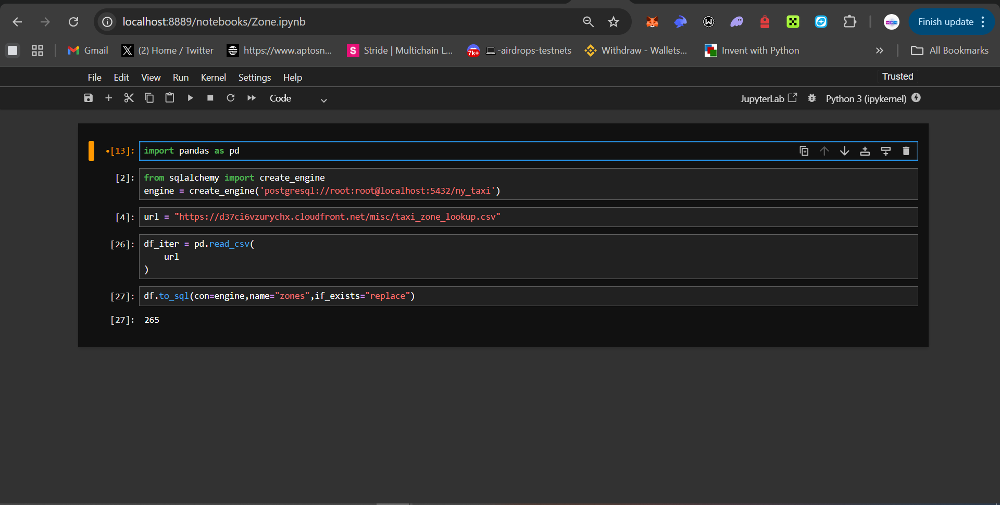
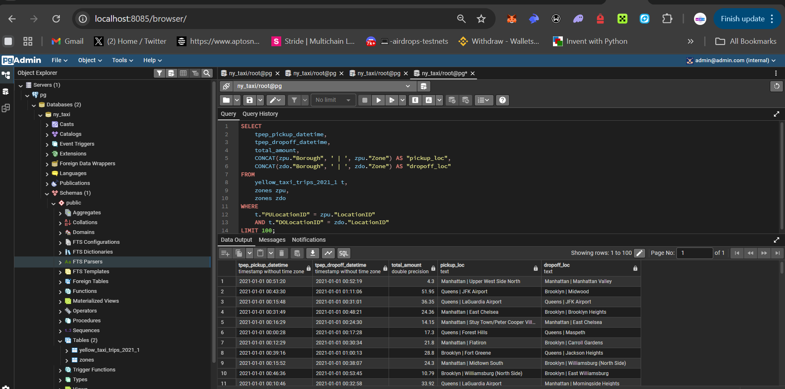

# SQL-Refresher.

## Instruction : Start the docker compose containing the postgres and pgadmin

``
docker compose up
``

## Start the jupter notebook

``
uv run jupyter notebook
``

# Opening Jupyter in Browser and Adding Zones ingestion from CSV files

## Opening pgadmin in Browser and Running Queries

